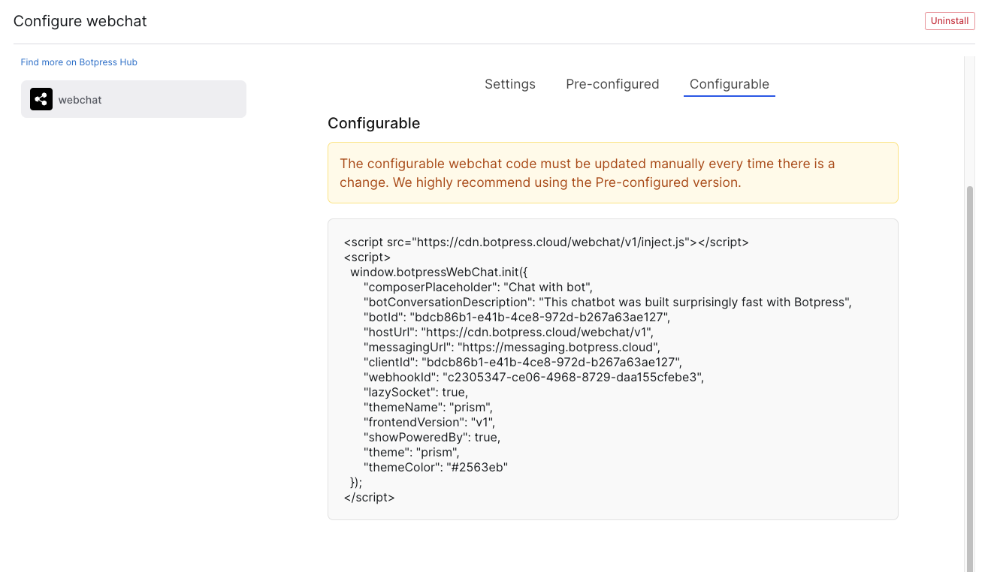
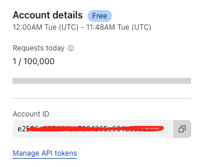
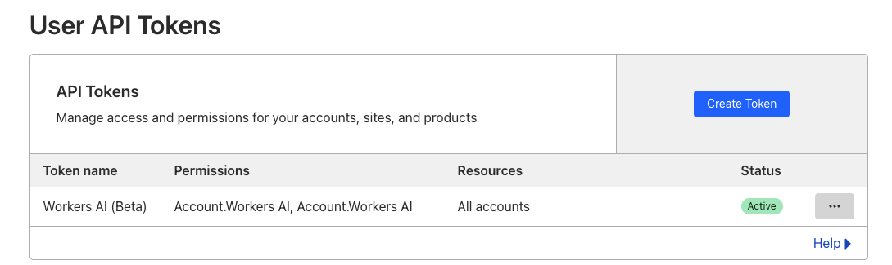
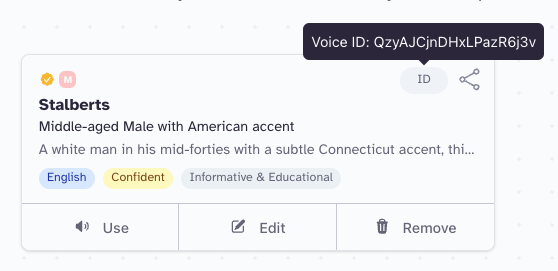
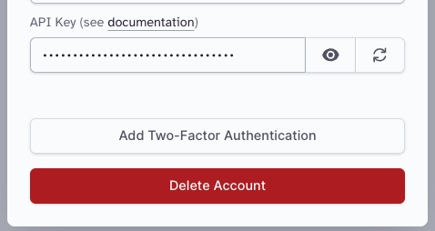

# Botpress Voice React Project

Talk to your Botpress bot, and give it a voice to talk back! This simple project is a template showing how you can integrated 3rd party services to bring speech to Botpress bots. All of the services used have very generous free tiers, so this project is free to spin up.

## Services Used:
* [Botpress Cloud](www.botpress.com) for the chatbot itself. Botpress is a cloud-hosted, GPT-native platform for quickly building chatbots.
* [Cloudflare AI Workers](https://developers.cloudflare.com/workers-ai/) for speech-to-text. Cloudflare AI Workers offer inference APIs for popular large language models. They have a very generous free tier, too!
* [Elevnlabs](https://elevenlabs.io/) for text-to-speech. They provide great-sounding voices and have a generous free tier.

This project uses Node.js and React.

## Quickstart

### 1. Clone this repo

`git clone github.com/`

### 2. Make a new .env

Copy [.env.example](./env.example) and rename it to `.env`.

### 3. Publish your Botpress Bot and get its info

You need your bot's BotID and ClientID. The easiest way to get this is to publish your bot, then go to the Admin panel > Integrations > Webchat > Configurable

### 4. Add your botId and clientId into the app

Open [Chatbot.tsx](./src/Chatbot.tsx) and add your botId and clientId to lines 25 and 28, respectively. If you have custom CSS, you can add its link to line 34. [The botpress styler](https://styler.botpress.com) makes it easy to generate a CSS for your bot!

### 5. Get your Cloudflare Account ID and API Key

Your cloudflare account id is visible in the sidebar when you visit your [cloudflare dashboard](https://dash.cloudflare.com/).

For your API key, click the 'manage API tokens' and then make a new API key.

Save these to the appropriate lines in your new `.env` file from step 2.

### 6. Get your Elevenlabs API Key and Voice

After signing up for elevenlabs, you can visit their [voice library](https://elevenlabs.io/app/voice-library) to find a voice you like. After adding it to your account, you can find the voice ID by hovering over the icon in the top right corner.

To get your elevenlabs API key, go to your profile and click on API keys. You can find your API key there.

Save these to the appropriate lines in your new `.env` file from step 2.

### 7. Run the project

`npm run start`